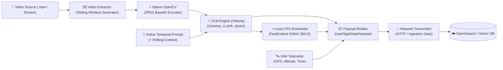

# S.O.V.V.A. Edge Pipeline

**S.O.V.V.A.** (**S**emantic **O**bservation / **V**ideo **V**ision **A**nalytics on Edge) is a high-performance, lightweight edge pipeline for real-time and near-real-time video analytics utilizing Vision-Language Models (VLM) and local semantic embedding generation for autonomous aerial platforms (UAVs / drones) and ground edge stations.

---

## 🚀 Key Features

- **Memory-Efficient Video Chunking:** Sliding window chunking with temporal overlap and uniform frame sampling powered by Python streaming generators (`yield`), preventing Out-Of-Memory (OOM) errors on resource-constrained hardware.
- **High-Performance Native Encoding:** Hardware-accelerated OpenCV C++ JPEG encoding (`cv.imencode`) directly to Base64, bypassing high-overhead imaging libraries.
- **Model Profile Registry & Active Prompting:** Modular configuration (`VLMModelProfile`, `OllamaOptions`, `ModelPromptTemplate`) supporting diverse VLM architectures (e.g., Gemma 4, LLaVA, Qwen2-VL, MiniCPM-V) with precise absolute frame timestamps (`datetime.timedelta`).
- **Rolling Temporal Scene Memory:** Sequential context chaining (`previous_caption`) providing the VLM with historical scene awareness without VRAM memory bloat or image token explosion.
- **Zero-Swapping Local CPU Embedder:** Blazing fast (~4.8 ms) local text embeddings via [`fastembed`](https://github.com/qdrant/fastembed) (`sentence-transformers/all-MiniLM-L6-v2` ONNX Runtime) running purely on CPU. This eliminates model swapping and VRAM thrashing on the GPU/NPU.
- **Strict Data Contracts & Validation:** Comprehensive Pydantic v2 domain schemas (`TelemetryData`, `SovvaPayload`, `UavFlightDataPayload`) enforcing 384-dimensional vector validation and complete integration with downstream vector stores (e.g., OpenSearch).
- **Fault-Tolerant Execution:** Resilient VLM calls with exponential backoff retries via `tenacity`, structured dual-channel logging (rotating file + stdout), and defensive OpenCV resource management (`try...finally`).

---

## 📚 Technical Architecture Documentation

Detailed documentation, design rationale, flow diagrams, and integration contracts are available in the [`docs/`](docs/README.md) directory:

- [docs/01_system_overview.md](docs/01_system_overview.md) – End-to-end architecture, Mermaid dataflow diagrams, technology stack, and module structure.
- [docs/02_video_processing.md](docs/02_video_processing.md) – Sliding window mathematical formulation, stride calculation, and frame extraction streaming.
- [docs/03_vlm_inference.md](docs/03_vlm_inference.md) – Model profile registry, active prompting, rolling scene memory, and local FastEmbed integration.
- [docs/04_configuration.md](docs/04_configuration.md) – Environment variables, `pydantic-settings`, and parameter tuning recommendations.
- [docs/05_data_flow_and_contracts.md](docs/05_data_flow_and_contracts.md) – Input/output schemas, telemetry alignment, and Data Gate API / OpenSearch payload contracts.
- [docs/06_ecosystem_and_roadmap.md](docs/06_ecosystem_and_roadmap.md) – UAV ecosystem integration, MAVLink telemetry synchronization, and forward-looking roadmap.
- [docs/07_code_review_and_production_improvements.md](docs/07_code_review_and_production_improvements.md) – Production audit, engineering maturity matrix, and optimization history.

---

## 🏗️ System Dataflow



---

## ⚡ Quick Start

### 1. Prerequisites

- Python 3.10+ (Python 3.11 - 3.14 supported)
- [Ollama](https://ollama.com/) running locally or accessible over the local network

### 2. Installation

```bash
# Clone the repository
git clone https://github.com/trawiasz-skuter/S.O.V.V.A.git
cd sovva-edge-pipeline

# Create and activate virtual environment
python3 -m venv .venv
source .venv/bin/activate

# Install dependencies
pip install -r requirements.txt
```

### 3. Pull Required VLM Model

```bash
# Pull the target vision-language model (e.g., Gemma 4 e2b or LLaVA)
ollama pull gemma4:e2b
```

### 4. Configuration

Create or edit your `.env` file in the project root:

```env
VIDEO_PATH="data/input/videoplayback.mp4"
TIME_OF_CHUNK=10
EXTRACTED_FRAMES_PER_CHUNK=4
OVERLAP_T=2
GATE_END_POINT="http://127.0.0.1:8000/api/ingest"
LOG_LEVEL="INFO"
LOG_FILE_PATH="logs"
```

### 5. Run the Pipeline

```bash
python src/main.py
```

---

## 📂 Project Structure

```text
sovva-edge-pipeline/
├── docs/                               # Comprehensive technical documentation
│   ├── README.md                       # Documentation index
│   ├── 01_system_overview.md           # Architecture, dataflow, and tech stack
│   ├── 02_video_processing.md          # Sliding window math and frame streaming
│   ├── 03_vlm_inference.md             # VLM client, prompting, and FastEmbed
│   ├── 04_configuration.md             # Pydantic settings and environment variables
│   ├── 05_data_flow_and_contracts.md   # Domain schemas and integration contracts
│   ├── 06_ecosystem_and_roadmap.md     # Ecosystem context and development roadmap
│   └── 07_code_review_and_production_improvements.md # Engineering review & audit
├── src/
│   ├── ai/                             # AI & inference subsystem
│   │   ├── base_convert.py             # High-speed OpenCV JPEG to Base64 encoder
│   │   ├── embedder.py                 # Local FastEmbed ONNX 384-D vector generator
│   │   ├── profiles.py                 # Multi-model configuration profiles registry
│   │   ├── prompt_builder.py           # Active temporal prompt builder & payload maker
│   │   ├── schemas.py                  # Pydantic inference options & template schemas
│   │   └── vlm_client.py               # Resilient Ollama client with tenacity retry
│   ├── core/                           # Domain entities and validation
│   │   ├── builder.py                  # Flight data payload assembly factory
│   │   └── schemas.py                  # Telemetry, Sovva, and Flight data Pydantic models
│   ├── network/                        # Transmission subsystem
│   │   └── transmitter.py              # Ingestion API client with error diagnostics
│   ├── video/                          # Video ingestion & processing
│   │   └── extractor.py                # Metadata extraction, chunking, frame generator
│   ├── config.py                       # Pydantic Settings configuration loader
│   └── main.py                         # Pipeline entry point & execution orchestrator
├── data/                               # Sample inputs and test video data
├── tests/                              # Automated test suite
├── requirements.txt                    # Project dependencies
└── README.md                           # Project documentation entry point
```

---

## 🛡️ License & Authors

Developed by **Jakub Matkowski** as part of the S.O.V.V.A. autonomous surveillance initiative.