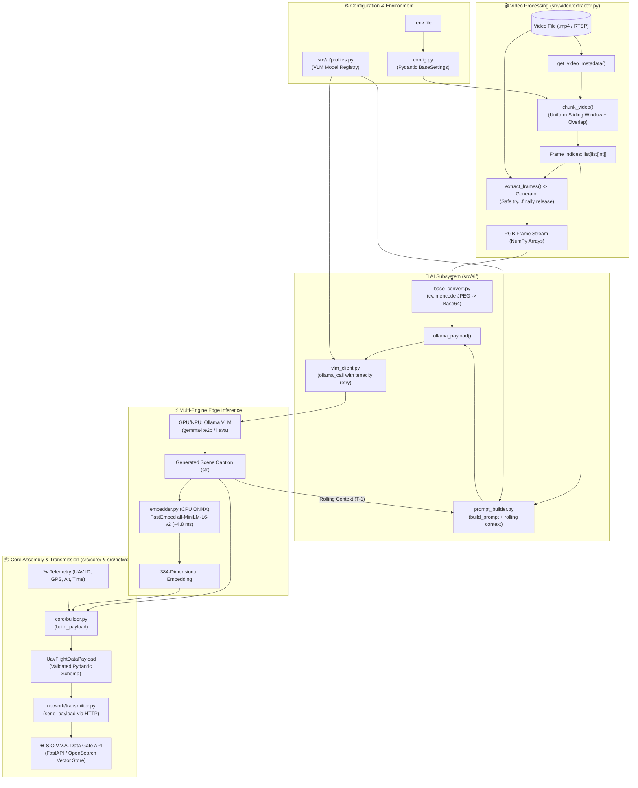

# 01. System Overview

## 📌 Project Objective

**S.O.V.V.A. Edge Pipeline** (Semantic Observation / Video Vision Analytics on Edge) is a lightweight, edge-optimized analytics pipeline designed for deployment on edge AI compute boards, autonomous UAV companion computers, and ground observation stations.

The core objectives of the system are:
1. **Video Ingestion:** Ingestion of video sources (local `.mp4` video files, and in future iterations, live drone RTSP video feeds).
2. **Intelligent Sliding Window Chunking:** Temporal partitioning with controllable overlap to prevent context loss across chunk boundaries while ensuring uniform frame sampling.
3. **Low-Memory Frame Streaming:** Sequential frame extraction via Python generators (`yield`), avoiding memory exhaustion on constrained hardware.
4. **Hardware-Accelerated Frame Encoding:** Native OpenCV C++ JPEG encoding to Base64 with custom compression quality.
5. **Active Temporal Prompting:** Enriching vision queries with accurate frame timestamps (`datetime.timedelta`) and task-specific instructions.
6. **Rolling Scene Context Chaining:** Preserving temporal continuity between consecutive chunks by injecting previous textual descriptions without VRAM overhead.
7. **Local VLM Inference:** Resilient interaction with local Vision-Language Models (e.g., Gemma 4, LLaVA, Qwen2-VL) via an extensible profile registry.
8. **Ultra-Fast Local CPU Embeddings:** Sub-5ms 384-dimensional vector generation via ONNX Runtime (`fastembed`), completely eliminating GPU model swapping between VLM and embedding models.
9. **Validated Flight Data Transmission:** Assembling typed Pydantic payloads merging telemetry and model outputs for downstream ingestion gates.

---

## 🏗️ High-Level Architecture & Dataflow



---

## 📂 Directory Structure

```text
sovva-edge-pipeline/
├── docs/                               # Architectural and technical documentation
│   ├── README.md                       # Documentation index
│   ├── 01_system_overview.md           # Architecture, dataflow, and tech stack
│   ├── 02_video_processing.md          # Sliding window math and frame streaming
│   ├── 03_vlm_inference.md             # VLM client, prompting, and FastEmbed
│   ├── 04_configuration.md             # Pydantic settings and environment variables
│   ├── 05_data_flow_and_contracts.md   # Domain schemas and integration contracts
│   ├── 06_ecosystem_and_roadmap.md     # Ecosystem context and development roadmap
│   └── 07_code_review_and_production_improvements.md # Engineering review & audit
├── src/
│   ├── ai/                             # AI & inference subsystem
│   │   ├── base_convert.py             # High-speed OpenCV JPEG to Base64 encoder
│   │   ├── embedder.py                 # Local FastEmbed ONNX 384-D vector generator
│   │   ├── profiles.py                 # Multi-model configuration profiles registry
│   │   ├── prompt_builder.py           # Active temporal prompt builder & payload maker
│   │   ├── schemas.py                  # Pydantic inference options & template schemas
│   │   └── vlm_client.py               # Resilient Ollama client with tenacity retry
│   ├── core/                           # Domain entities and validation
│   │   ├── builder.py                  # Flight data payload assembly factory
│   │   └── schemas.py                  # Telemetry, Sovva, and Flight data Pydantic models
│   ├── network/                        # Transmission subsystem
│   │   └── transmitter.py              # Ingestion API client with error diagnostics
│   ├── video/                          # Video ingestion & processing
│   │   └── extractor.py                # Metadata extraction, chunking, frame generator
│   ├── config.py                       # Pydantic Settings configuration loader
│   └── main.py                         # Pipeline entry point & execution orchestrator
├── data/                               # Sample inputs and test video data
├── tests/                              # Automated test suite
├── requirements.txt                    # Project dependencies
└── README.md                           # Project documentation entry point
```

---

## 🛠️ Technology Stack

- **Runtime:** Python 3.10+ (tested through Python 3.14)
- **Computer Vision & Video Decoding:**
  - `opencv-python` (`cv2`): Video file probing, frame seeking, colorspace transformation (`BGR` to `RGB`), and hardware-assisted JPEG encoding (`cv.imencode`).
- **Configuration & Validation:**
  - `pydantic` (v2.7+): Domain entity validation, vector length constraints, and schema serialization.
  - `pydantic-settings` (v2.2+): Strongly-typed environment configuration loaded from `.env`.
- **Inference Engines:**
  - `ollama`: Vision-language model client for local multi-modal models (e.g., `gemma4:e2b`, `llava:7b`).
  - `fastembed`: High-throughput, CPU-optimized ONNX runtime embeddings (`sentence-transformers/all-MiniLM-L6-v2`).
- **Resilience & Networking:**
  - `tenacity`: Configurable retry policies with exponential backoff for VLM API calls.
  - `requests`: HTTP transmission of structured payloads to the ingestion gateway.
  - `logging`: Dual-channel structured logging (concurrent console output and persistent file logs).
