# 02. Video Processing & Chunking

Source module: [`src/video/extractor.py`](../src/video/extractor.py)  
Conversion module: [`src/ai/base_convert.py`](../src/ai/base_convert.py)

---

## 🎯 Module Objective

The video processing module is responsible for ingesting video data, extracting container metadata, and partitioning the continuous timeline into discrete, overlapping temporal chunks using an intelligent sliding window algorithm. 

Key design priorities include:
1. **Zero Memory Spikes:** Frames are extracted on-demand via Python streaming generators (`yield`).
2. **Temporal Redundancy:** Configurable temporal overlap ensures dynamic actions occurring on chunk boundaries are never truncated or lost.
3. **Hardware Descriptor Safety:** Resource lifecycles are strictly managed via `try...finally` blocks to guarantee OpenCV handles are released under all exit conditions.

---

## 🧮 Chunking Mathematics & Formulation

### 1. Input Parameters
- $T_{chunk}$ (`TIME_OF_CHUNK`): Duration of each observation window in seconds (e.g., $10\text{ s}$).
- $T_{overlap}$ (`OVERLAP_T`): Overlap duration between consecutive chunks in seconds (e.g., $2\text{ s}$).
- $N_{frames}$ (`EXTRACTED_FRAMES_PER_CHUNK`): Number of frames sampled from each chunk for VLM inference (e.g., $4$).
- $FPS$: Frames per second of the video stream.
- $F_{total}$: Total frame count of the video stream.

### 2. Stride & Window Calculation

$$F_{chunk} = \lfloor T_{chunk} \times FPS \rfloor$$
$$F_{overlap} = \lfloor T_{overlap} \times FPS \rfloor$$
$$Stride = F_{chunk} - F_{overlap}$$

> [!IMPORTANT]
> **Precondition:** $T_{overlap} < T_{chunk}$, which guarantees $Stride > 0$. If this condition is violated, `chunk_video` raises a `ValueError("Overlap time has to be shorter than chunk time.")`.

### 3. Uniform Frame Sampling per Chunk

For each chunk starting at frame index $Start$ and ending at $End = \min(Start + F_{chunk}, F_{total})$:
$$\text{Current Chunk Span: } L = End - Start$$

The index of the $i$-th frame ($i \in \{0, \dots, N_{frames}-1\}$) within the full video timeline is determined by:
$$FrameIdx_i = Start + \left\lfloor \frac{(L - 1) \cdot i}{\max(1, N_{frames} - 1)} \right\rfloor$$

Following computation, frame indices are deduplicated and sorted ascendingly (`sorted(list(set(...)))`) to prevent duplicate frame extraction on boundary chunks.

```mermaid
gantt
    title Sliding Window with 20% Overlap Visualization
    dateFormat X
    axisFormat %s s
    section Chunk 1
    0s to 10s (4 frames sampled) :active, c1, 0, 10
    section Chunk 2
    8s to 18s (4 frames sampled) :c2, 8, 18
    section Chunk 3
    16s to 26s (4 frames sampled) :c3, 16, 26
```



---

## ⚙️ Function Reference

### `get_video_metadata(video_path: str) -> tuple[float, int, int, int]`
- Instantiates `cv.VideoCapture(video_path)`.
- Validates that the file was successfully opened (`if not cap.isOpened(): raise FileNotFoundError`).
- Reads container properties:
  - `FPS` (`cv.CAP_PROP_FPS`),
  - `Width` (`cv.CAP_PROP_FRAME_WIDTH`),
  - `Height` (`cv.CAP_PROP_FRAME_HEIGHT`),
  - `Frame count` (`cv.CAP_PROP_FRAME_COUNT`).
- Explicitly releases the capture handle (`cap.release()`).
- Returns `(fps, width, height, frame_count)`.

### `chunk_video(...) -> list[list[int]]`
- Computes the partition indices for the entire video.
- Returns a 2D list `all_chunks_indices`, where each element is an array of absolute frame indices corresponding to one analysis chunk.

### `extract_frames(video_path: str, all_chunks_indices: list) -> Generator[list[np.ndarray], None, None]`
- Operates as a **Python generator**:
  ```python
  cap = cv.VideoCapture(video_path)
  try:
      for chunk in all_chunks_indices:
          frames = []
          for frame_idx in chunk:
              cap.set(cv.CAP_PROP_POS_FRAMES, frame_idx)
              ret, frame = cap.read()
              if ret:
                  frames.append(cv.cvtColor(frame, cv.COLOR_BGR2RGB))
          if frames:
              yield frames
  finally:
      cap.release()
  ```
- **Defensive Resource Management:** The `finally` block guarantees `cap.release()` is executed even if consumer execution terminates prematurely (`break` or unhandled exceptions).
- Converts raw frames from OpenCV's default BGR colorspace to RGB.

---

## ⚡ High-Speed Frame Encoding: `src/ai/base_convert.py`

Multimodal VLMs expect image inputs encoded as Base64 strings. Rather than instantiating high-overhead Python objects via Pillow, `convert_tobase` employs native C++ OpenCV compression:

```python
def convert_tobase(chunk: list[np.ndarray], quality: int = 85) -> Iterator[str]:
    encode_params = [int(cv.IMWRITE_JPEG_QUALITY), quality]
    for idx, frame in enumerate(chunk):
        bgr_frame = cv.cvtColor(frame, cv.COLOR_RGB2BGR)
        success, buffer = cv.imencode(".jpg", bgr_frame, encode_params)
        if success:
            yield base64.b64encode(buffer.tobytes()).decode("utf-8")
```

### Performance Advantages:
- **3x Faster Encoding:** `cv.imencode` executes directly in C++ without intermediate memory copies.
- **Lower GC Pressure:** Avoids allocating temporary `io.BytesIO` streams and Python `PIL.Image` wrappers.
- **Adjustable Compression:** The `quality` parameter (default `85`) balances visual acuity with payload transmission size.
