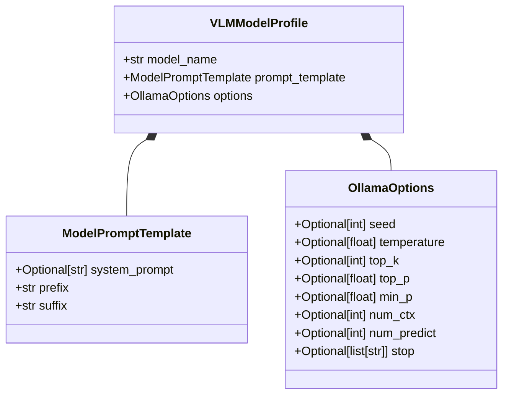

# 03. AI Integration, Prompting & Inference

Subsystem: `src/ai/`  
Key modules:
- [`src/ai/profiles.py`](../src/ai/profiles.py) – VLM Model configuration profile registry
- [`src/ai/schemas.py`](../src/ai/schemas.py) – Pydantic models for options and prompt templates
- [`src/ai/prompt_builder.py`](../src/ai/prompt_builder.py) – Active temporal prompting & payload generation
- [`src/ai/vlm_client.py`](../src/ai/vlm_client.py) – Resilient Ollama client with retry policies
- [`src/ai/embedder.py`](../src/ai/embedder.py) – Local FastEmbed ONNX 384-D vector generator

---

## 🏛️ 1. Multi-Model Profile Architecture

Different Vision-Language Models exhibit distinct behavioral characteristics regarding instruction formatting, optimal generation temperature, and context length requirements. The pipeline employs a **Strategy / Profile-Driven Pattern**:



### Profile Registry: `src/ai/profiles.py`
New models can be added by registering a profile in `MODEL_PROFILES` without modifying application business logic:

```python
MODEL_PROFILES: Dict[str, VLMModelProfile] = {
    "gemma4:e2b": VLMModelProfile(
        model_name="gemma4:e2b",
        prompt_template=ModelPromptTemplate(
            system_prompt="You are an edge AI vision assistant deployed on an autonomous UAV.",
            prefix="You are given a sequence of images captured by an aerial drone.\n...",
            suffix="Analyze the sequence in chronological order.\nFor whole chunk:\n- describe the sequence...",
        ),
        options=OllamaOptions(seed=42, temperature=0.0, num_ctx=4096),
    ),
    "llava:7b": VLMModelProfile(
        model_name="llava:7b",
        prompt_template=ModelPromptTemplate(...),
        options=OllamaOptions(temperature=0.1, num_ctx=2048),
    ),
}
```

---

## 📝 2. Active Temporal Prompting & Rolling Scene Memory

### Frame Timestamps (`datetime.timedelta`)
To provide the VLM with chronological awareness, `build_prompt` computes absolute time offsets for each frame based on the stream FPS:

$$\text{Timestamp}_i = \text{str}\left(\text{timedelta}\left(\text{seconds}=\frac{\text{FrameIdx}_i}{FPS}\right)\right)$$

### Rolling Scene Context Chaining
To maintain situational awareness across continuous observations without incurring the catastrophic cost of appending past image tokens, the pipeline applies a **Markovian rolling context** (`previous_caption`):

```python
def build_prompt(
    frames_idxs: list, 
    fps: float, 
    template: ModelPromptTemplate, 
    previous_caption: str | None = None
) -> str:
    lines = [template.prefix.strip(), ""]

    if previous_caption:
        lines.append(f'Context from immediately preceding scene: "{previous_caption}"')
        lines.append("")

    for i, j in enumerate(frames_idxs, 1):
        raw_timestamp = j / fps
        timestamp = str(datetime.timedelta(seconds=raw_timestamp))
        lines.append(f"Image {i}: timestamp {timestamp}")

    lines.append("")
    lines.append(template.suffix.strip())
    return "\n".join(lines)
```

#### Why Rolling Text Context is Superior on Edge Hardware:
- **Zero VRAM Bloat:** Historical image tokens are discarded, keeping inference latency and attention memory consumption constant regardless of mission duration.
- **Narrative Continuity:** The model tracks object trajectories (e.g., "the vehicle identified earlier is now completing its turn").
- **Self-Correcting:** Transient hallucinations from earlier chunks decay naturally rather than compounding indefinitely.

---

## 🤖 3. Resilient VLM Client: `src/ai/vlm_client.py`

Calls to local VLM daemons can occasionally suffer from transient GPU allocation latency or process contention. `ollama_call` wraps execution with `tenacity` retries and custom domain exceptions:

```python
class VLMInferenceError(Exception):
    """Raised when the VLM fails to generate an analysis."""
    pass

@retry(
    stop=stop_after_attempt(3),
    wait=wait_exponential(multiplier=1, min=2, max=10),
    reraise=True,
)
def ollama_call(profile: VLMModelProfile, messages: list[dict]) -> str:
    options_dict = profile.options.model_dump(exclude_none=True)
    response = chat(
        model=profile.model_name,
        messages=messages,
        options=options_dict if options_dict else None,
    )
    content = response.message.content
    if not content:
        raise VLMInferenceError(f"Ollama returned an empty response for {profile.model_name}")
    return content
```

---

## ⚡ 4. High-Throughput Local CPU Embeddings: `src/ai/embedder.py`

Rather than routing text embedding requests through Ollama (which competes for GPU VRAM with the VLM), semantic vectors are generated locally on the CPU via **FastEmbed** (`sentence-transformers/all-MiniLM-L6-v2` compiled for ONNX Runtime).

```python
def response_embedding(response_content: str, model_name: str = DEFAULT_MODEL_NAME) -> list[float]:
    embedder = get_embedder(model_name)
    embeddings = list(embedder.embed([response_content]))
    return embeddings[0].tolist()
```

### Architectural Impact:
1. **Elimination of Model Swapping:** Standard Ollama deployments (`OLLAMA_MAX_LOADED_MODELS=1`) purge the multi-gigabyte VLM from GPU memory whenever an embedding model is called. Moving embeddings to CPU saves **1.0 to 4.0 seconds per chunk**.
2. **Ultra-Low Latency:** Inference completes in **~4.8 ms** on modern CPUs.
3. **Strict Dimensionality:** Generates standardized **384-dimensional dense vectors** matching the `SovvaPayload` Pydantic constraint.
