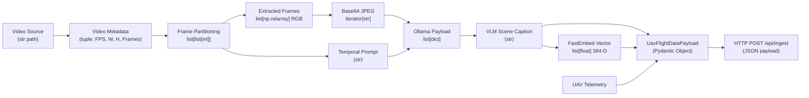

# 05. Data Flow & Integration Contracts

Modules: 
- Schemas: [`src/core/schemas.py`](../src/core/schemas.py)
- Factory: [`src/core/builder.py`](../src/core/builder.py)
- Transmitter: [`src/network/transmitter.py`](../src/network/transmitter.py)

---

## 🔄 End-to-End Data Transformation Lifecycle



### Stage Type Matrix

| Processing Stage | Executing Function | Input Type | Output Type | Description |
| :--- | :--- | :--- | :--- | :--- |
| **1. Metadata Extraction** | `get_video_metadata()` | `str` | `tuple[float, int, int, int]` | Reads `(fps, width, height, frame_count)`. |
| **2. Chunk Partitioning** | `chunk_video()` | `int, int, int, float, int` | `list[list[int]]` | E.g., `[[0, 83, 166, 250], [200, 283, 366, 450], ...]`. |
| **3. Frame Extraction** | `extract_frames()` | `str, list[list[int]]` | `Generator[list[np.ndarray]]` | Yields batches of NumPy arrays in RGB format. |
| **4. Native Encoding** | `convert_tobase()` | `list[np.ndarray], int` | `Iterator[str]` | Base64-encoded JPEG strings via `cv.imencode`. |
| **5. Temporal Prompt** | `build_prompt()` | `list[int], float, template, prev` | `str` | Prompt formatted with frame timestamps and prior context. |
| **6. Message Assembly** | `ollama_payload()` | `str, Iterator[str], sys_prompt` | `list[dict]` | Conforms to Ollama Chat API message structure. |
| **7. VLM Inference** | `ollama_call()` | `profile, list[dict]` | `str` | Descriptive scene caption generated by VLM. |
| **8. CPU Embedding** | `response_embedding()`| `str` | `list[float]` | 384-dimensional dense semantic vector via FastEmbed. |
| **9. Payload Building** | `build_payload()` | Scalars & vectors | `UavFlightDataPayload` | Strongly-typed domain entity. |
| **10. Network Transmission**| `send_payload()` | `UavFlightDataPayload` | `None` / HTTP Status | Dispatches JSON to S.O.V.V.A. Ingestion Gate. |

---

## 📡 Pydantic Domain Schemas (`src/core/schemas.py`)

```python
from datetime import datetime
from typing import List
from pydantic import BaseModel, Field

class TelemetryData(BaseModel):
    drone_id: str = Field(..., description="UAV's unique identification code")
    timestamp: datetime = Field(..., description="Observation capture time (UTC)")
    location: list[float] = Field(..., description="[latitude, longitude] coordinates of the UAV")
    altitude: float = Field(..., description="Altitude of the UAV in meters")

class SovvaPayload(BaseModel):
    model_name: str = Field(..., description="Identifier of the vision model used")
    caption: str = Field(..., description="Textual description generated by VLM")
    embedding: List[float] = Field(..., min_length=384, max_length=384, description="384-D dense semantic embedding")

class UavFlightDataPayload(BaseModel):
    model_data: SovvaPayload
    metrics: TelemetryData
```

---

## 🌐 External Ingestion Contract (`/api/ingest`)

When dispatched to the downstream S.O.V.V.A. Data Gate API, the payload serializes to the following JSON contract:

```json
{
  "model_data": {
    "model_name": "gemma4:e2b",
    "caption": "A white commercial vehicle turns right onto an unpaved road while maintaining moderate speed.",
    "embedding": [
      0.01234,
      -0.04567,
      0.08912,
      "... 384 floating point values ..."
    ]
  },
  "metrics": {
    "drone_id": "dfg231s",
    "timestamp": "2026-09-06T19:00:00Z",
    "location": [30.0, 21.3],
    "altitude": 20.3
  }
}
```

### Destination OpenSearch Index Structure (`sovva`):

```json
{
  "@timestamp": "2026-09-06T19:00:00Z",
  "sovva": {
    "uav": {
      "drone_id": "dfg231s",
      "telemetry": {
        "location": {
          "lat": 30.0,
          "lon": 21.3
        },
        "altitude_m": 20.3
      }
    },
    "vlm": {
      "model_type": "gemma4:e2b",
      "caption": "A white commercial vehicle turns right onto an unpaved road...",
      "embedding": [0.01234, -0.04567, 0.08912, "..."]
    }
  }
}
```
