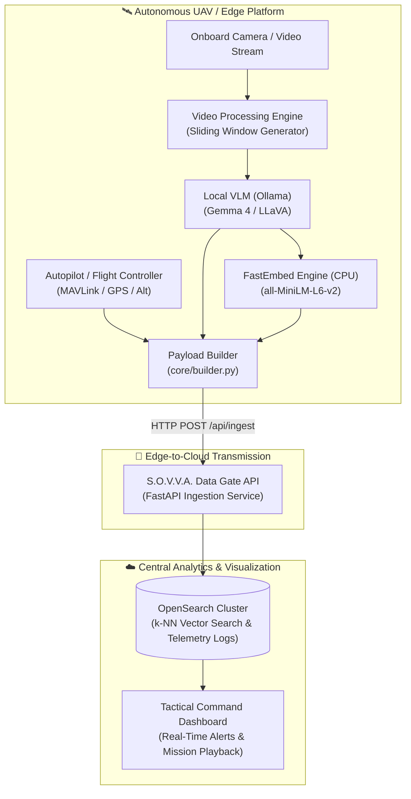

# 06. Ecosystem Context & Roadmap

---

## 🌐 S.O.V.V.A. Ecosystem Context

The **S.O.V.V.A. Edge Pipeline** serves as the distributed on-board analytical brain within a larger autonomous aerial surveillance ecosystem:

---

## 🚀 Development Roadmap

### ✅ Phase 1: Core Foundation & High-Performance Inference (Completed)
- [x] **Sliding Window Chunking:** Temporal chunking with configurable overlap and uniform frame sampling.
- [x] **Memory-Safe Streaming:** Python generator pipelines preventing Out-Of-Memory exceptions on edge hardware.
- [x] **High-Speed Frame Compression:** Native C++ OpenCV JPEG encoding (`cv.imencode`), bypassing Pillow overhead.
- [x] **Model Profile Registry:** Strongly-typed Pydantic model configurations (`VLMModelProfile`, `OllamaOptions`, `ModelPromptTemplate`).
- [x] **Active Temporal Prompting:** Chronological frame timestamping via `datetime.timedelta`.
- [x] **Rolling Scene Memory:** Chained context (`previous_caption`) maintaining event continuity across chunks without VRAM token bloat.
- [x] **Local CPU Embeddings:** FastEmbed ONNX Runtime integration producing 384-D vectors in ~4.8 ms, eliminating GPU VRAM model swapping.
- [x] **Observability & Resilience:** Dual-channel logging (file + console), defensive OpenCV cleanup (`try...finally`), and `tenacity` retries.

---

### ⏳ Phase 2: Production Hardening & Network Resilience (In Progress)
- [ ] **HTTP Keep-Alive Session:** Persistent `requests.Session()` in `transmitter.py` to reuse TCP/TLS connections across chunks.
- [ ] **Store-and-Forward Offline Buffer:** Local embedded storage (e.g., SQLite outbox) queuing payloads during transient cellular or radio link loss and flushing upon reconnection.
- [ ] **Precise Telemetry Timestamp Alignment:** Synchronizing telemetry timestamps directly with the video stream timecode:
  $$T_{\text{chunk}} = T_{\text{video\_start}} + \Delta t (\text{start\_frame} / \text{FPS})$$
- [ ] **Automated Test Suite:** Comprehensive `pytest` test suite covering `chunk_video`, prompt construction, and Pydantic schema validation.

---

### 🔮 Phase 3: Real-Time Streaming & Native Acceleration (Future)
- [ ] **Live RTSP Stream Handling:** Circular memory ring buffer for live RTSP streams with automated reconnection logic.
- [ ] **Producer-Consumer Threading:** Decoupling video decoding, VLM inference, and network transmission into asynchronous concurrent worker queues (`threading.Queue` / `asyncio`).
- [ ] **Native Apple Silicon MLX Client:** Dedicated `src/ai/mlx_client.py` utilizing Apple's MLX Unified Memory framework to eliminate HTTP socket overhead entirely.
- [ ] **Structured JSON Extraction Mode:** Constraining VLM output directly to strict Pydantic schemas for automated target tracking and anomaly classification.
